# Ginos Italian Restaurant

Ginos Italian restaurant specializes in traditional Italian cuisine. The website's primary goal is to promote the restaurants authentic and traditional cuisine. Additionally, I wanted to make my website user-friendly and simple to use so that anyone using the website would have a positive experience. This website is targeted towards people who love traditional Italian food and to people who just enjoy food, social gatherings and anyone who wants to spend a night in with a takeaway or a night out with family or friends. The website will be useful to potential users because, visitors to the website will gain insight into what they should expect from Ginos Italian Restaurant when they visit the site.

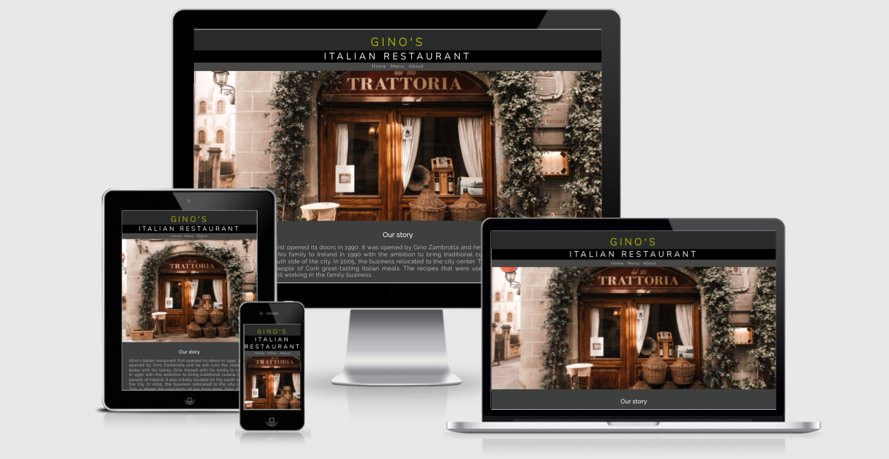

# Table of Contents
 * [UX](#id-ux)
    * [User stories](#id-user)
 * [Features](#id-features) 
    * [Navigation](#id-nav)
    * [Landing](#id-landing)
    * [Content](#id-content)
        * [Introduction](#id-introduction)
        * [Takeaway](#id-take)
    * [Opening Hours](#id-open)
    * [Iframe](#id-frame)
    * [Footer](#id-foot)
    * [Menu](#id-food)
    * [Feedback Form](#id-feed)
    * [Thank you](#id-thanks)
    * [Testing](#id-testing) 
 * [Validator Testing](#id-validator)
 * [Bugs](#id-bugs)
 * [Unfixed Bugs](#id-unfix)
 * [Technologies used](#id-tech) 
 * [Deployment](#id-deploy)
 * [Credits](#id-credits)
 * [Acknowledgements](#id-acknowledgements)

# UX

## User Stories

* As a customer
  * As a customer I want to be able to see images of the food and restaurant.
  * As a customer I want to be able to read the menu and I would like to see pricing.
  * As a customer I would like to be be able to see where the restaurant is located.
  * As a customer I'd like access to Ginos Social Media accounts, so that I can read customer reviews.
  * As a customer I want there to be a feedback form so I can give my opionions and feedback.
* As a returning customer
  * As a returning customer I want to be able to read the menu and I would like to see pricing and food as this may have changed.
* As a business owner
  * As a business owner I want to attract new customers.
  * As a business owner I want to get the customers feedback so that the service can be improved. 
  * As the business owner I want to improve the online presence to encourage users to come to Ginos Italian Restaurant. 

  # Features

* ## Navigation bar
 

     * At the top of the page, just below the logo, you'll find the navigation bar in the center of the screen. Users can choose from three different tabs: Home, Menu, and About. Clicking on the logos above the navbar will also bring the user back to the Home page. 
     * This website has a fixed navigation bar. This will allow the navigation bar to follow the user down the page as they scroll down. Rather than having to scroll to the top of the page every time, the user can navigate the website more easily.
     * The navigation bar appears exactly the same on all three pages.

* ## Landing Image
 
   * One of the first things that a users will see when they open the website is the landing image in the body of the page. This image depicts the restaurant interior. The image is useful as his helps set the scene for users and gives them a sense of how the dining experience in the restaurant would be.

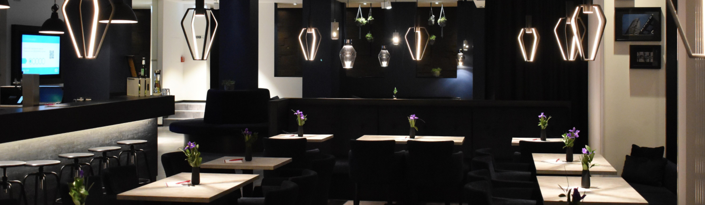

* ## Content

  * ### Introduction
 
    * This is a short introduction to the restaurant to attempt to entice the user to want to try out what the restaurant what it offers. This is useful to users and it gives them more of an insight in what they can expect from the restaurant.

   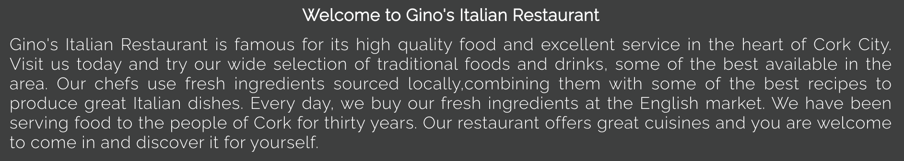

  * ### Takeaway
 
    * This feature of is the takeaway section. This is where the user will find out how to order.
    * This section of the website is useful to the user as it contains information for on how to order takeaway.
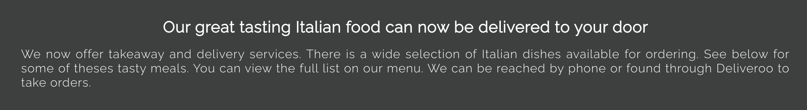

* ## Opening Hours
 
   * This shows the premises opening hours for dining in or takeaway.
   * Just as the user scrolls down the website the operating hours are available this is centered in the middle of the screen so its easy for the user to notice. 
   * This is beneficial as its important information for the user, as they could potenially visit or order from the restaurant and the opening times can be easily found. 

* ## Iframe
 
   * Just at the bottom of the page above the footer an iframe is positioned, this shows the address of the restaurant. This feature can be clicked on and this brings the user to google maps where they can find directions to the restaurant. This benefits the user as it makes it easy to find the restaurant location.
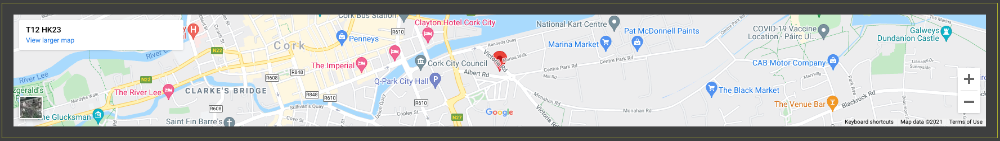

* ## Footer
 
   * At the footer of the page the restaurants contact information is provided. The restaurants phone number, email and address are available. The information is benefical to the user as this gives them information to contact the restaurant to make an order. 
  * Also provided at the bottom of the page are the restaurants social media links Facebook Instagram and Twitter. The user can follow and interact with the restaurant and check customer reviews. 
  * There is also menu times shown at the footer. This informs the customer at what times lunch, dinner are served and there is also an early bird menu which offer discounted prices.  
  * The footer appears the same on all three webpages.
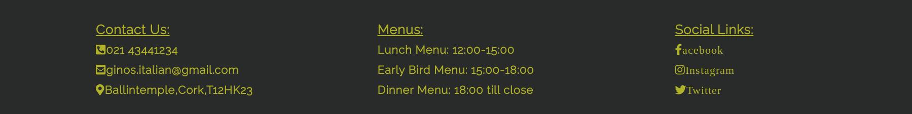

* ## Menu

   * Users are presented with four separate menu options on the Menu page. There is a lunch menu, an early bird menu, a dinner menu, and a drinks menu. The benefits the user as the menu communicates information such as the menu items available and the price of those items.
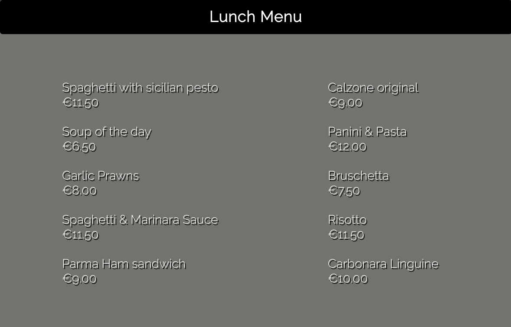

* ## Feedback Form

   * The feedback form can be found in the about section of the website. Users benefit from the feedback form since it allows them to communicate directly with the restaurant about their experiences.
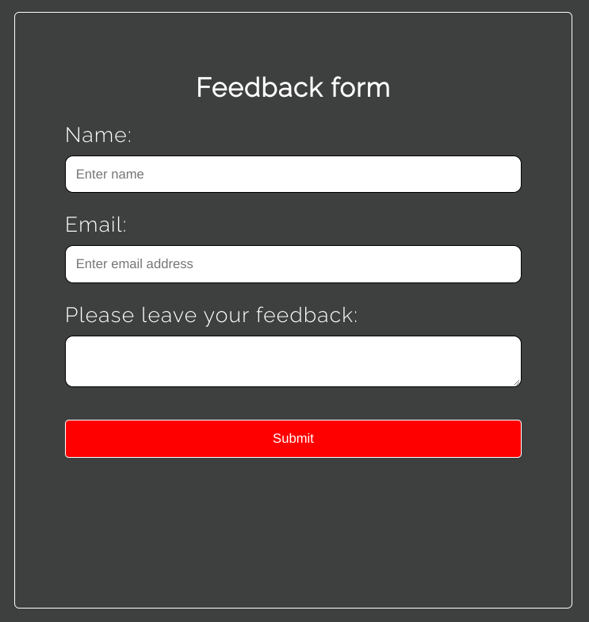

* ## Thank you

   * Thankyou.html was developed to improve the feedback experience for users. 
   * When the user fills out the form and clicks on submit, they will be directed to this thank you page. 
   * The user receives a response, letting them know that their message was sent. The experience is enhanced since the user receives confirmation.
   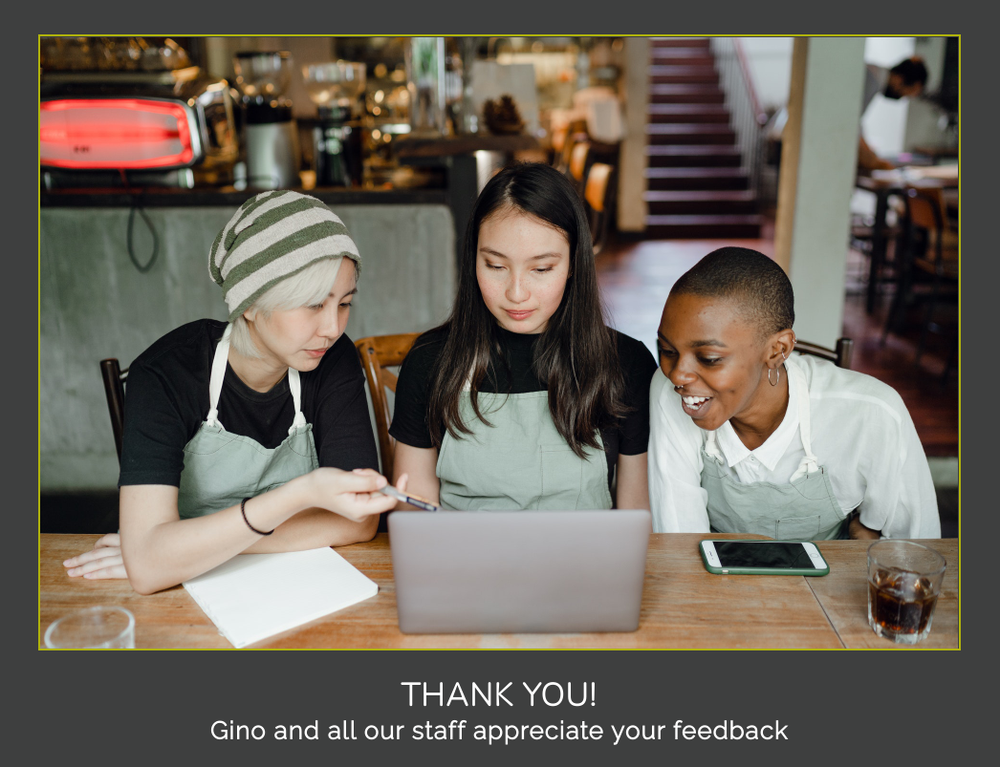

# Testing

* Search Engines
  * I tested my website on Google Chrome, Safari and Mozilla Firefox and all pages, links on those pages, and footer icon links performed well on each of those search engines. I tested the website navigation and internal links and iframe and confirmed that these also worked on those search engines.
* Amiresponsive
  * To test my website on all iphone devices I used [am i responsiveness](http://ami.responsivedesign.is/). I added a screenshot of how these look on the top of the Read.me 
* Mobile phone/Tablets
  * Using devtools, I tested the responsiveness of the site on all mobile devices and tablets supported by the tool. In addition, I tested it using my Samsung Galaxy A50 phone, an Iphone 12 Pro, and an iPad.
* Laptop  
  * I tested the website responsiveness for laptops and larger screens using an Apple Macbook an Apple Imac and an ASUS Chromebook Flip C434, as well as using responsiveness devtools.
* Feedback form
  * Below are the results of my testing of the Feedback form.
    * The form will not be submitted if the name and email text boxes or feedback textarea are not filled out.
    * If you try to submit the email without entering an @ symbol, a message will request that an email address is entered.
    * After selecting the submit button, the user will be directed to the thank you page. This confirms the response has been sent.

# Validator Testing

* HTML
  * I tested all four webpages on the W3C HTML validation service and all four passed with no errors detected.
  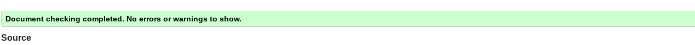
 

* CSS
  * I also tested my websites CSS on the W3C CSS validation service and this also passed with no errors detected.
  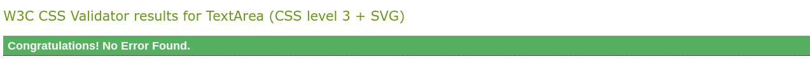

* Accessibility
  * For each page of the website, I used devtools to run lighthouse, and they all scored well primarily on accessibility. Below are the results for each webpage

    * Home
    
      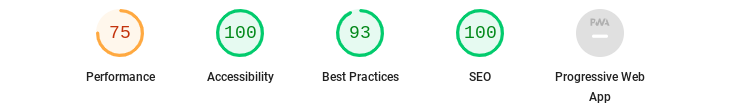

    
    * Menu
    
      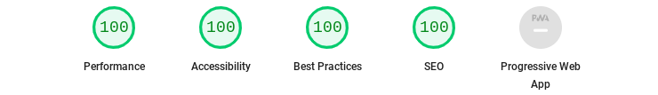

    
    * About
    
      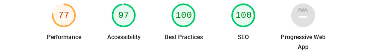

    * Thank you
    
      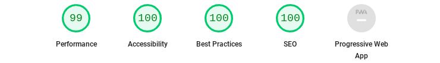

# Bugs

*  When I deployed my website I discovered there was an issue when testing responsiveness on my Samsung Galaxy A50. 
   * The image below shows the bug before it was fixed. The footer overlaps the header and navigation bar when viewing on mobile devices.
   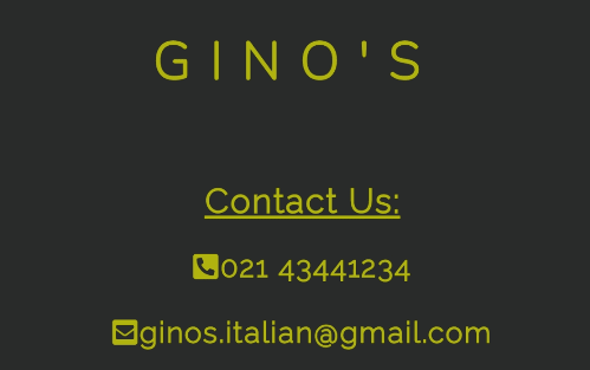
* The problem was solved by adding z-index 2 to the header and z-index 1 to the footer. Once the header index number is higher than the footer index the header and navigation bar would overlap the footer as I had intended.
* After my website was deployed, I had a second problem on the about.html page. My website has a fixed header. This was causing issues because the fixed header was preventing input fields from working correctly in the form. I could only use the input fields when I scrolled to the top of the form. But as I scroll down further the input fields fail to work. 
* I tried to solve this with positioning and using z-index but this did not work. With some help from Slack, I fixed this issue by removing the 400px height from my header, and the form now works correctly.

# Unfixed Bugs
 
* I encountered one issue while testing the website on iPhone 12 Pro and Apple Ipad. Contact numbers appear in blue text and are underlined in the footer. 
* The error did not appear on any other device I tested on. It also didn't appear on Chrome dev tools when testing on iPhone 12 pro. 
* The image below shows this bug. I was unable to fix this.
  
  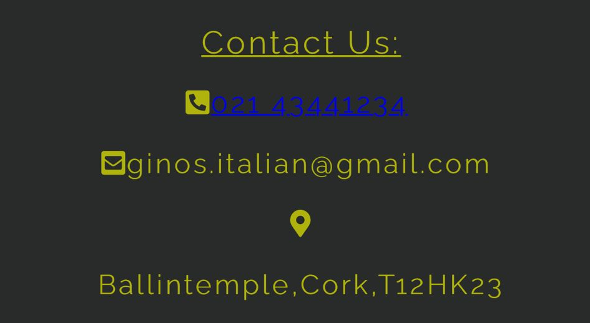

* Additionally, I ran into a problem when I posted my project on Slack for review. An individual on Slack noticed that the iframe repeated on his desktop and the pin did not appear or was not interactive.
* Afterwards, I looked at it again on a desktop and I tested this on two different desktops, but I did not encounter this issue.
* Since I could not locate the problem, I was unable to fix it.
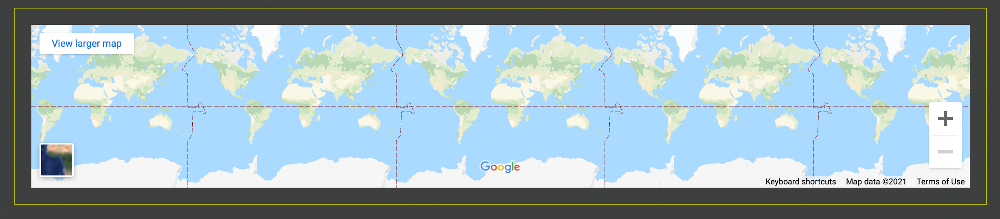

# Technologies Used

* HTML5- Structure and website layout.
* CSS3- Styled my website.
* Gitpod 
* GitHub 
* Google Fonts- For the fonts used.
* Font Awesome - Footer Icons.

# Deployment

These are the steps used to deploy the website. The site was deployed using GitHub.
* Create the repository for the website you wish to publish.
* The next step is to push code.
* Then go to the settings.
* Scroll down to Github pages and click on the link.
* Then at the source there is a drop down icon click on this and select main branch.
* The page will refresh with a link to the website. Once the link is selected then website is deployed.

The live link to this website can be found here - [Gino's Italian Restaurant](https://squirkey89.github.io/Gino-s-Italian-Portfolio-project/)

# Credits

**Content**
  * The code used to create the feed back form was taken from [w3schools](https://www.w3schools.com/howto/howto_css_contact_section.asp) .
  * For the two different font styles applied in this project I used [Google Fonts](https://fonts.google.com).
  * Code was referenced from Dani Krossing's [YouTube channel](https://www.youtube.com/watch?v=kEf1xSwX5D8) when creating this website's Favicon.
  * I used Am I Responsive web site for checking responsiveness on all Apple devices screen sizes [am i responsiveness](http://ami.responsivedesign.is/).
  * I used maps.ie to add a pin to my iframe of the business location [maps.ie](https://www.maps.ie/create-google-map/).
  * In designing my header, navigation bar and footer I referenced the [love running project](https://github.com/Code-Institute-Org/love-running-2.0).

**Media**
  * All images and background images used in the website were taken from [pexels](https://www.pexels.com/).
  * For icons in the footer I used [font awesome](https://fontawesome.com/v5.15/icons?d=gallery&p=2).
  * The icon used for the websites favicon was created and downloaded from [Favicon Generator](https://favicon.io/favicon-generator/).

# Acknowledgments

   * My mentor for the useful feedback direction and guidance.
   * The online tutors and the slack community for help and and advice.
   * Code Institite course material.

